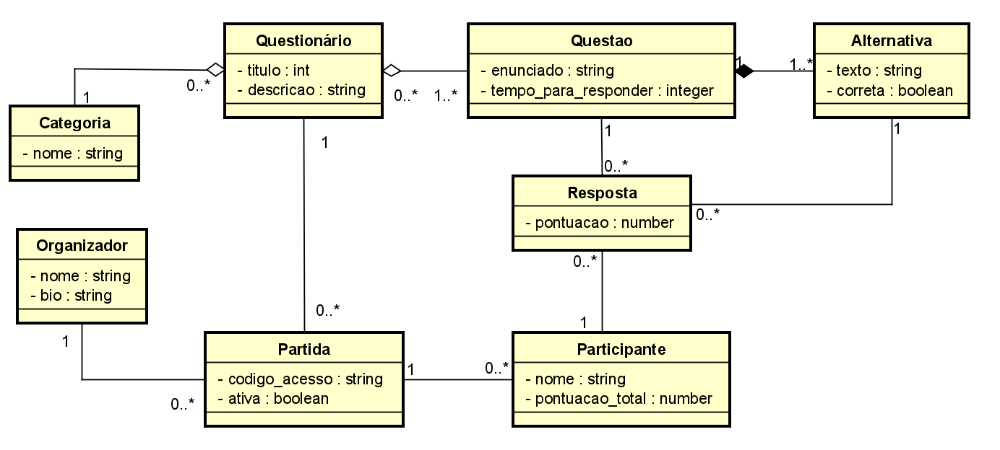
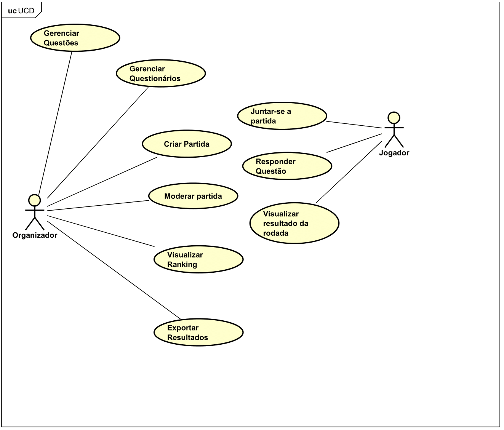
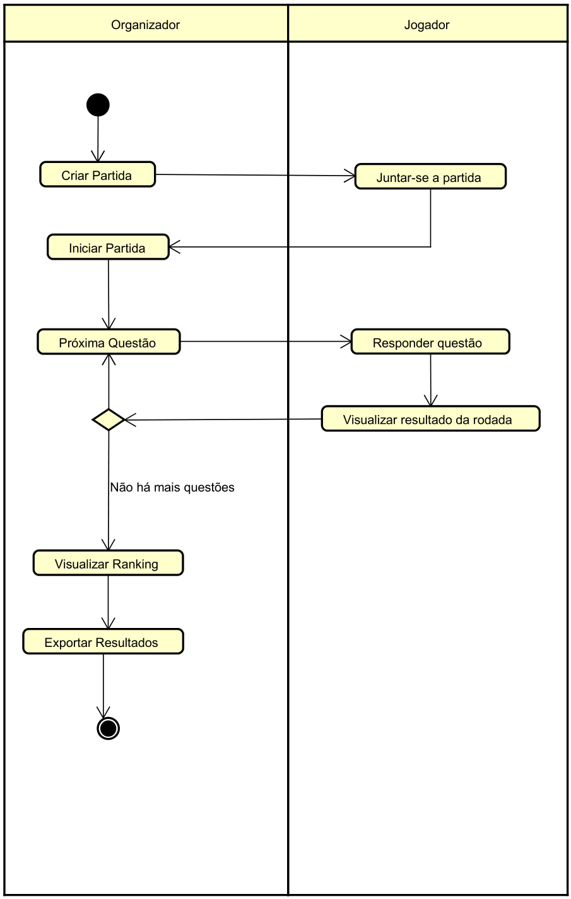

# Índice da Documentação

1. [Documento de Visão](#visao)
2. [Imagens](#imagens)
   - [Diagrama de Classes de Domínio](#diagrama-de-classes)
   - [Diagrama de Casos de Uso](#diagrama-de-casos-de-uso)
   - [Diagrama de Atividade](#diagrama-de-atividade)

## Documento de Visão

O **Documento de Visão** é um artefato de requisitos que descreve os objetivos, o escopo, as funcionalidades principais e as restrições do projeto, servindo como um guia para todos os envolvidos.

[Documento de Visão](md/visao.md)

## Imagens

### Diagrama de Classes de Domínio

### Diagrama de Casos de Uso

### Diagrama de Atividade

